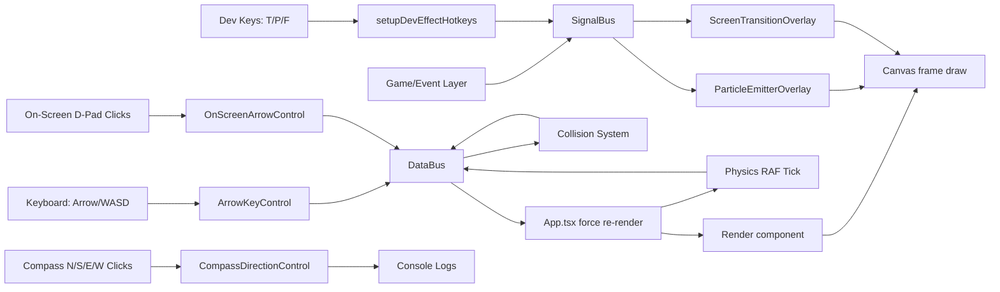

## UrsaManus Architecture and Data Flow

This document explains how input, state, logic, and rendering flow through the current engine setup.

---

## 1) High-Level Flow

---

## 2) Module Responsibilities

### UI composition (`App.tsx`)

- Selects active game mode (`side-scroller` / `top-down`) via local state.
- Syncs active mode to URL query (`?mode=...`) for shareable demos.
- Mounts matching prebuilt canvas + controls presets for the active mode.
- In development, exposes capsule toggles for:
    - `Show/Hide debug outlines`
    - `Show/Hide dev controls` (in-page cheat sheet panel)

### Game mode presets (`src/components/gameModes/`)

- `SideScrollerCanvas`
    - Configures world + gravity side-scroller tuning.
    - Mounts render canvas and effects overlays.
- `TopDownCanvas`
    - Configures world + disables player gravity/physics.
    - Mounts render canvas and effects overlays.

### Input controls (`src/components/screenController/`)

- `ArrowKeyControl`
    - Subscribes to `keydown`.
    - Handles Arrow keys and WASD.
    - Calls `dataBus` movement methods.
- `OnScreenArrowControl`
    - Clickable D-pad buttons (`↑ ↓ ← →`).
    - Calls `dataBus` movement methods.
- `CompassDirectionControl`
    - Clickable `N/S/E/W` buttons.
    - Currently logs directions (reserved for future actions).
- `ScreenControl` / `ScreenControlGroup` / `ScreenController`
    - Visual primitives and layout wrappers for controller UI.
- `SideScrollerControls`
    - Prebuilt side-scroller control composition.
- `TopDownControls`
    - Prebuilt top-down control composition.

### State and simulation (`DataBus`)

- Holds authoritative `GameState`.
- Owns entity collection (`entitiesById`, `playerId`).
- Applies movement and collision resolution.
- Manages world bounds entities and collision masking.
- Exposes opt-in gravity/physics stepping per entity.

### Save services (`src/services/save/`)

- `schema.ts`
    - Defines versioned `SaveGameV1` payload contract.
    - Validates incoming save payloads and version compatibility.
- `state.ts`
    - Serializes `DataBus` `GameState` into JSON-safe save objects.
    - Rehydrates validated save payloads back into live `DataBus` state.
- `bus.ts`
    - Handles quick save/load persistence in localStorage (`ursa:quickSave:v1`).
    - Provides throttled autosave scheduler used by app runtime updates.
- `file.ts`
    - Exports save snapshots as downloadable `.json` files.
    - Imports user-provided `.json` files with structured error reporting.

### Save docs index

- [docs/save/CHEATSHEET.md](save/CHEATSHEET.md)
    - Fast API/shortcut/error-code reference for day-to-day use.
- [docs/save/README.md](save/README.md)
    - End-to-end save/load workflows with copy/paste snippets.
- [src/services/save/README.md](../src/services/save/README.md)
    - Module-level contributor notes for save internals.

### Physics (`src/logic/physics/`)

- `createPhysicsBody`
    - Builds typed physics bodies with sensible defaults.
- `stepEntityPhysics`
    - Integrates velocity/gravity using clamped delta time for stable frame behavior.
- `DEFAULT_GRAVITY_CONFIG`
    - Baseline gravity, terminal velocity, and max frame delta.

### Rendering (`Render`)

- Loads/caches sprite sheets.
- Animates frame selection from tile sequences.
- Draws entities to canvas each RAF tick.
- Optionally draws collider debug rectangles (via `showDebugOutlines`).

### Effects (`src/components/effects/`)

- `ScreenTransitionOverlay`
    - Subscribes to transition play signals through `useScreenTransition`.
    - Draws pixelated transition cells over the canvas container.
- `screenTransitionSignal`
    - Defines the transition payload contract.
    - Emits the `effects:screen-transition:play` signal.
- `ParticleEmitterOverlay`
    - Subscribes to particle emit signals through `useParticleEmitter`.
    - Updates and draws particles in an overlay canvas.
- `particleEmitterSignal`
    - Defines particle burst payload contract.
    - Emits the `effects:particles:emit` signal.
- `dev/devEffectHotkeys`
    - Development-only keybind wiring for effect previews.
    - Emits transition and particle presets with `T`/`P`.
    - Controls continuous torch emitter lifecycle with `F` / `Shift+F`.

---

## 3) Frame Lifecycle

1. Input event occurs (keyboard or on-screen control).
2. Corresponding control calls `dataBus.movePlayer*`.
3. `DataBus` updates player position and resolves blocking collisions.
4. App triggers a re-render (`force` state increment).
5. `Render` receives updated entity data and paints next frame.

### Physics frame lifecycle (opt-in)

1. App RAF loop computes `deltaMs` and calls `dataBus.stepPhysics(deltaMs)`.
2. `DataBus` runs `stepEntityPhysics` for entities with physics bodies.
3. Axis movement is applied with collision checks (`isBlockedBySolid`).
4. Blocked axes are reverted and axis velocity is zeroed.
5. App re-renders only when physics reports position changes.

### Save/load lifecycle

1. App state changes (input, camera pan, physics movement).
2. Quick-save scheduler batches frequent updates.
3. Scheduler executes `quickSave()` to persist `SaveGameV1` in localStorage.
4. On startup, `quickLoad()` attempts to restore the latest quick save.
5. Optional manual export/import flows use `exportSaveFile()` / `importSaveFile(file)`.
6. Import path validates payload schema/version before rehydration into `DataBus`.

### Transition lifecycle (signal path)

1. Any module emits `effects:screen-transition:play` using `playScreenTransition` or `playBlackFade`.
2. `ScreenTransitionOverlay` receives the payload and starts cover animation.
3. `onCovered` runs at full cover (safe point for scene/world swap).
4. Reveal phase runs.
5. `onComplete` runs after transition ends.

### Particle lifecycle (signal path)

1. Any module emits `effects:particles:emit` using `emitParticles`.
2. `ParticleEmitterOverlay` receives spawn payload and creates particle instances.
3. RAF updates apply velocity, drag, gravity, and life decay.
4. Particle overlay draws active particles over the game canvas.
5. Expired/out-of-bounds particles are removed from the simulation.

### Dev preview lifecycle (development only)

1. `setupDevEffectHotkeys` attaches window key/mouse listeners.
2. Landing-page dev controls tab provides in-page hotkey/input reference.
3. `T` emits screen transition previews across variants/corners.
4. `P` emits particle preset previews at random in-bounds coordinates.
5. `F` starts/repositions a named torch emitter at mouse position (or center fallback).
6. `Shift+F` and teardown cleanup stop the named torch emitter.

---

## 4) Collision Pipeline (Current)

- Player movement attempts are axis-separated (`x` then `y`).
- `isBlockedBySolid` checks collision rules and blocks invalid movement.
- `CollisionSystem.update()` emits events for collision phases.
- Collision events are currently logged for visibility.

---

## 5) Extending the Architecture

### Add new input types

- Build a new control component under `src/components/screenController/`.
- Invoke `dataBus` methods (or future command/event layer) in handlers.
- Re-export in `screenController/index.ts` and mount in `App.tsx`.

### Add gameplay systems

- Add reusable logic under `src/logic/`.
- Keep state transitions centralized in `DataBus`.
- Feed renderable entities to `Render` without UI-specific coupling.

### Add new renderable entities

- Ensure entity shape matches `RenderableItem` requirements.
- Provide sprite sheet metadata and animation tiles.
- Add optional collider config for collision/debug draw.

---

## 6) Testing Strategy Mapping

- Behavior tests
    - Input effects (`ArrowKeyControl`, `OnScreenArrowControl`, `CompassDirectionControl`).
- Layout tests
    - Primitive wrappers (`ScreenControl`, `ScreenControlGroup`, `ScreenController`).
- Extended tests
    - Canvas/render edge cases and branch-heavy scenarios.

Current suite reaches 100% statement/branch/function/line coverage for included files.
