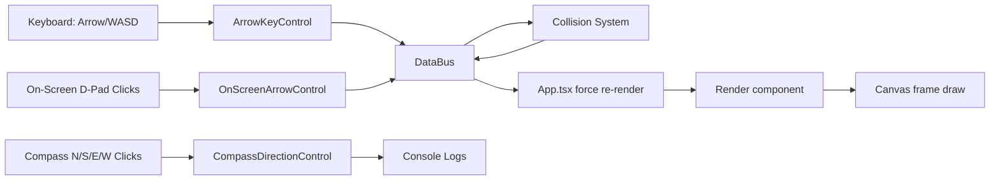

## UrsaManus Architecture and Data Flow

This document explains how input, state, logic, and rendering flow through the current engine setup.

---

## 1) High-Level Flow

---

## 2) Module Responsibilities

### UI composition (`App.tsx`)

- Configures world size and world bounds.
- Mounts `ScreenController` and child controls.
- Pulls entities from `dataBus.getState().entitiesById` and passes them to `Render`.

### Input controls (`src/components/screenController/`)

- `ArrowKeyControl`
    - Subscribes to `keydown`.
    - Handles Arrow keys and WASD.
    - Calls `dataBus` movement methods.
- `OnScreenArrowControl`
    - Clickable D-pad buttons (`↑ ↓ ← →`).
    - Calls `dataBus` movement methods.
- `CompassDirectionControl`
    - Clickable `N/S/E/W` buttons.
    - Currently logs directions (reserved for future actions).
- `ScreenControl` / `ScreenControlGroup` / `ScreenController`
    - Visual primitives and layout wrappers for controller UI.

### State and simulation (`DataBus`)

- Holds authoritative `GameState`.
- Owns entity collection (`entitiesById`, `playerId`).
- Applies movement and collision resolution.
- Manages world bounds entities and collision masking.

### Rendering (`Render`)

- Loads/caches sprite sheets.
- Animates frame selection from tile sequences.
- Draws entities to canvas each RAF tick.
- Optionally draws collider debug rectangles.

---

## 3) Frame Lifecycle

1. Input event occurs (keyboard or on-screen control).
2. Corresponding control calls `dataBus.movePlayer*`.
3. `DataBus` updates player position and resolves blocking collisions.
4. App triggers a re-render (`force` state increment).
5. `Render` receives updated entity data and paints next frame.

---

## 4) Collision Pipeline (Current)

- Player movement attempts are axis-separated (`x` then `y`).
- `isBlockedBySolid` checks collision rules and blocks invalid movement.
- `CollisionSystem.update()` emits events for collision phases.
- Collision events are currently logged for visibility.

---

## 5) Extending the Architecture

### Add new input types

- Build a new control component under `src/components/screenController/`.
- Invoke `dataBus` methods (or future command/event layer) in handlers.
- Re-export in `screenController/index.ts` and mount in `App.tsx`.

### Add gameplay systems

- Add reusable logic under `src/logic/`.
- Keep state transitions centralized in `DataBus`.
- Feed renderable entities to `Render` without UI-specific coupling.

### Add new renderable entities

- Ensure entity shape matches `RenderableItem` requirements.
- Provide sprite sheet metadata and animation tiles.
- Add optional collider config for collision/debug draw.

---

## 6) Testing Strategy Mapping

- Behavior tests
    - Input effects (`ArrowKeyControl`, `OnScreenArrowControl`, `CompassDirectionControl`).
- Layout tests
    - Primitive wrappers (`ScreenControl`, `ScreenControlGroup`, `ScreenController`).
- Extended tests
    - Canvas/render edge cases and branch-heavy scenarios.

Current suite reaches 100% statement/branch/function/line coverage for included files.
